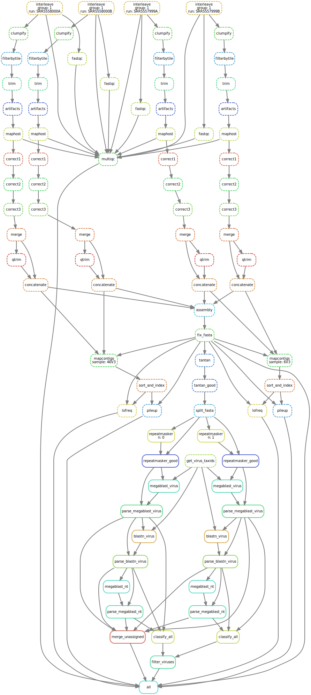

# Discover virome

Snakemake workflow for virome quantitation using assembled metagenomes.

## Setup environment and install prerequisites

### Install miniconda

Download and install miniconda https://conda.io/docs/user-guide/install/index.html.
In case of Linux, following should work:

```bash
wget https://repo.continuum.io/miniconda/Miniconda3-latest-Linux-x86_64.sh
bash Miniconda3-latest-Linux-x86_64.sh
```

### Install environment

Create conda environment with **snakemake**. 
There are two options:

1. If you want to upload your results to [Zenodo](zenodo.org), then you need snakemake Zenodo remote provider, which is currently implemented in *zenodo-simple* branch in my forked snakemake repo. 

First, clone snakemake repo and checkout *zenodo-simple* branch:

```bash
git clone https://tpall@bitbucket.org/tpall/snakemake.git
cd snakemake
git checkout zenodo-simple
```

Then, create conda environment, install prerequisites and snakemake:

```bash
conda env create -f environment.yml -n snakemake
source activate snakemake
pip install -e .
```

2. Alternatively, if you don't want to upload your results to Zenodo, you can create conda environment and install snakemake 'normally': 

```bash
conda create -n snakemake -c bioconda -c conda-forge snakemake
source activate snakemake
```

### Setup databases

Together all databases will occupy ~250GB+ from your HD. 

#### BLAST databases

1. Download BLAST databases

Briefly, you can use `update_blastdb.pl` script from BLAST+ software bundle to update/download BLAST databases.

To get BLAST, you can start by creating conda environment with blast+ like so:

```bash
conda env create -n blastenv
conda blastenv activate
conda install -c bioconda blast
```

Change working directory to location where you want BLAST databases to be installed, e.g. `$HOME/databases/blast`. 

```bash
mkdir -p $HOME/databases/blast
cd $HOME/databases/blast
```

Use update_blastdb.pl (included with the BLAST+ package) to check available version 4 databases, use the --blastdb_version flag:

```bash
update_blastdb.pl --blastdb_version 4 --showall
```

Download nt and nr databases (takes time and might need restarting if connection drops):

```bash
update_blastdb.pl nt --decompress
update_blastdb.pl nr --decompress
```

2. Setup BLASTDB environment variable
Edit $HOME/.bashrc file to permanently add BLASTDB variable to your shell environment

```bash
echo 'export BLASTDB=$HOME/databases/blast' >> $HOME/.bashrc
source $HOME/.bashrc
echo $BLASTDB
```

#### Download reference genome databases

1. Human reference genome.

First, create a directory for the reference genome sequence file, e.g `mkdir -p $HOME/databases/ref_genomes && cd $HOME/databases/ref_genomes`.

Then, human refgenome human_g1k_v37.fasta.gz sequences file can be obtained like so:

```bash
wget --continue ftp://ftp.ncbi.nlm.nih.gov/1000genomes/ftp/technical/reference/human_g1k_v37.fasta.gz
```

2. Bacterial reference genome sequences.

Create a directory for the bacteria reference sequence files.
Download all *genomic.fna.gz files to the directory by using command.

```bash
wget --recursive --continue ftp://ftp.ncbi.nlm.nih.gov/refseq/release/bacteria/*genomic.fna.gz
```

Unzip the files and concatenate all the files into a single file.
Use "bwa index" command to create index for the BWA algorithm.

3. Add full paths to `human_g1k_v37.fasta` and `Bacteria_ref_genome.fna` to config.yaml as `ref_genome:` and `ref_bacteria`, repectively.


### Install workflow 

Clone this repo and cd to repo
(Change URL accordingly if using HTTPS)

```bash
git clone git@github.com:avilab/quantify-virome.git
cd quantify-virome
```

### Example

#### Dry run

```bash
snakemake -n
```

#### Create workflow graph

```bash
snakemake -d .test --dag | dot -Tsvg > graph/dag.svg
```

#### Run workflow

This workflow is designed to run on hpc cluster, e.g. slurm. `cluster.json` configuration file may need some customisation, for example partition name. Memory nad maximum runtime limits are optimised for 20 splits. Number of splits can be specified in `config.yaml` file with n_files option (currently n_files is 2). Installation of software dependencies is taken care by conda and singularity, hence there is software installation overhead when you run this workflow for the first time in new environment. 

Example workflow submission script for slurm cluster, where values for job name, cluster partition name, time and memory constraints, and slurm log path (output) are taken from cluster.json: 

```bash
snakemake -j --use-conda --cluster-config cluster.json  \
             --cluster "sbatch -J {cluster.name} \
             -p {cluster.partition} \
             -t {cluster.time} \
             --mem {cluster.mem} \
             --output {cluster.output}"
```

You may want to use also following flags when running this workflow in cluster:

```bash
--max-jobs-per-second 1 --max-status-checks-per-second 10 --rerun-incomplete --keep-going
```

All other possible [snakemake execution](https://snakemake.readthedocs.io/en/stable/executable.html) options can be printed by calling `snakemake -h`.

### Exit/deactivate environment

Conda environment can be closed with the following command when work is finished:

```bash
source deactivate
```

### Workflow graph
For technical reasons, workflow is split into two parts, virome and taxonomy, that can be run separately, but taxonomy depends on the output of virome. Virome subworkflow (virome.snakefile) munges, masks, and blasts input sequences. Taxonomy subworkflow (Snakefile) merges blast results with taxonomy data and generates report.



Figure 1. **Workflow** graph with test sample split into two (default = 20) subfiles for parallel processing.

